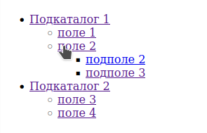

# Тестовое задание в АпТрейдер
## Текст
Задача :
Нужно сделать django app, который будет реализовывать древовидное меню, соблюдая следующие условия:
1) Меню реализовано через template tag
2) Все, что над выделенным пунктом - развернуто. Первый уровень вложенности под выделенным пунктом тоже развернут.
3) Хранится в БД.
4) Редактируется в стандартной админке Django
5) Активный пункт меню определяется исходя из URL текущей страницы
6) Меню на одной странице может быть несколько. Они определяются по названию.
7) При клике на меню происходит переход по заданному в нем URL. URL может быть задан как явным образом, так и через named url.
8) На отрисовку каждого меню требуется ровно 1 запрос к БД
 Нужен django-app, который позволяет вносить в БД меню (одно или несколько) через админку, и нарисовать на любой нужной странице меню по названию.



При выполнении задания из библиотек следует использовать только Django и стандартную библиотеку Python.

## Описание решения

* Так как в задании нужно использовать 1 запрос на таблицу, то решением было получить все элементы одного меню и потом отсортировать.
* Все, что над выделенным пунктом - развернуто. Мною понималось так

Тут выбран пункт меню "поле 2"

* ручка для доступа к меню _/menu_ но необходимо создать запись в таблице _CategoryMenu_ с названием "Категория_1"